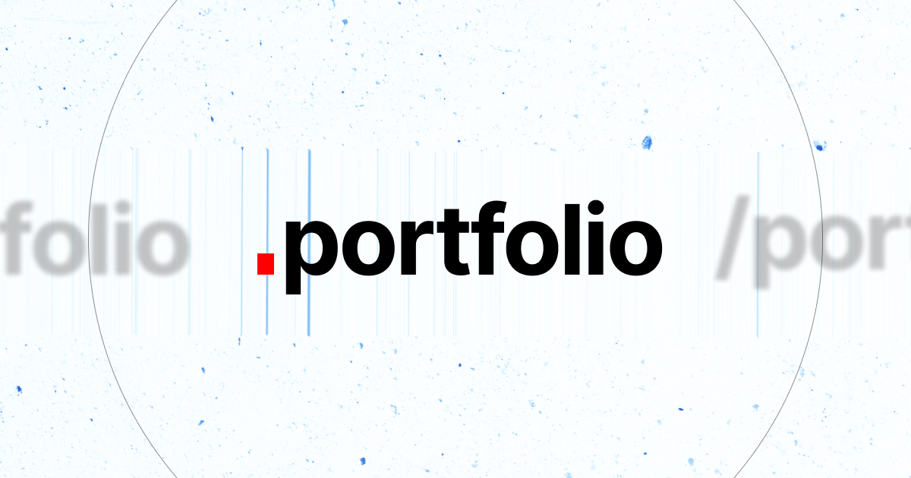

# Portfolio 

A brutalist and minimal portfolio interface. Designed with an adherence to Swiss typography, architectural grid systems, and kinetic interactions. 

**Currently under active development.**

## Architecture

This interface abandons heavy UI components in favor of raw typography and spatial contrast. Built entirely on React and raw CSS, prioritizing browser-native processes over third-party animation libraries.

* **Typography Engine:** Utilizes fluid CSS `clamp()` functions to scale massively across viewports without breaking structural boundaries.
* **Layout Mechanics:** CSS Grid implementations for data matrices.
  * Dynamic Viewport Height (`100dvh`) with `viewport-fit=cover` to bleed into mobile hardware safe areas. (Figuring out)
  * Intentional typographic clipping (`overflow: hidden`) for heavy descenders on the footer marks.
* **Glassmorphism Integration:** Uses backdrop-filters (`blur(24px) saturate(150%)`) for dynamic navbar masking over high-contrast imagery.

## Tech Stack

* **Core:** React 18
* **Build Tool:** Vite
* **Styling:** Pure CSS (CSS Variables, Flexbox, CSS Grid)
* **Deployment:** Vercel (Edge Network)

## Local Development (TBC)

To run this environment locally:

1. Clone the repository
2. Install dependencies:
```bash
npm install
```
3. Spin up the local Vite server:
```bash
npm run dev

```


## Status

**[ WORK IN PROGRESS ]** Core routing, global styling, and structural components are live. Content and specific interaction physics are actively being calibrated.

